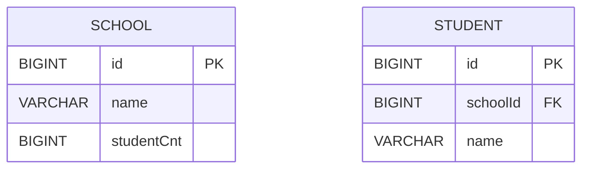
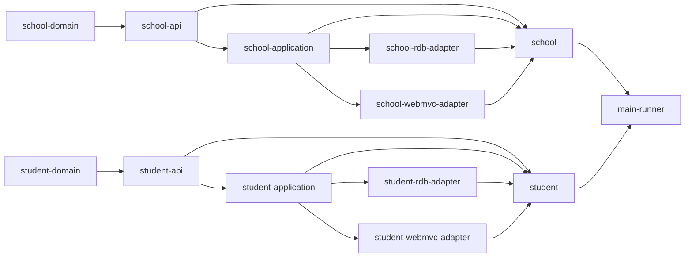
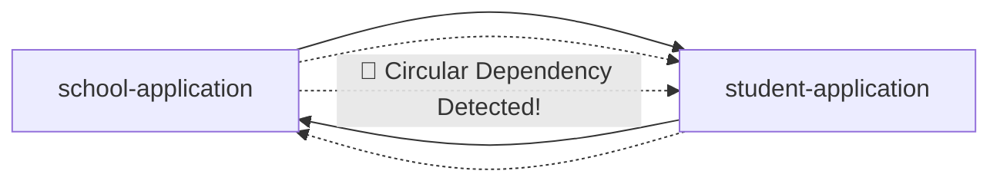

# custom-rest-client-core
Multi Module 에서 타 도메인의 서비스를 이용할 시 발생하는 `순환참조`를 예방하고 효율적인 유지보수를 위한 모듈 샘플

## ☝️간단 도메인으로 구성
- **학교**: 학교 이름과 총 학생 수가 있습니다.
- **학생**: 다니고 있는 학교의 id와 이름이 존재합니다.


## ⬢ Hexagonal Architecture를 기반한 모듈 참조 그래프


## 🚨타 도메인 수정을 위한 비즈니스 요구사항 발생

- 요구사항: 해당 학교에 학생이 등록 시, 그 학교의 총 학생 수를 증가시킨다.
- 비즈니스 코드 탐색
  - student service 탐색
  ```java
  public class StudentCommandService implements StudentCreateUseCase {
    
    private final StudentCommandRepositoryPort StudentCommandRepositoryPort;
    
     /*
       🚨 학생 등록 시, 해당 학교에 전첸 학생 수를 증가시키는 요구사항 추가
     */  
    @Override
    public Student createStudent(Student student) {
        return StudentCommandRepositoryPort.save(student);
    }
  }

  ```
  - school port 탐색
  ```java
   public interface SchoolCommandRepositoryPort { 
    School save(School school);

    School updateStudentCnt(Long id);
  }
  ```

### ❌ 해결방안 1

- student-application은 school-application을 의존하여 SchoolCommandRepositoryPort 호출
- 코드 예시
  ```java
  public class StudentCommandService implements StudentCreateUseCase {

  private final StudentCommandRepositoryPort StudentCommandRepositoryPort;
  // ❌ 해결방안 1
  private final SchoolCommandRepositoryPort schoolCommandRepositoryPort;

  /*
  🚨 학생 등록 시, 해당 학교에 전체 학생 수를 증가시키는 요구사항 추가
  */
  @Override
  public Student createStudent(Student student) {
        var newStudent =  StudentCommandRepositoryPort.save(student);
        
        //  ❌ 해결방안 1
        // 학교 총 학생 수 업데이트 로직 호출
        schoolCommandRepositoryPort.updateStudentCnt(newStudent.getSchoolId());
        
        return newStudent;
  }
  }
  ```
- 😩문제점 발생
  - 현재는 student-application이 school-application을 의존하지만, 변화하는 요구사항에 shcool-application이 student-application을 의존할수도 있습니다.
     - **‼ 모듈 순환 참조 에러 발생**


  - 모듈 순환 참조를 방지하기 위해 도메인과 도메인이 상하 관계를 맺는 제약적인 사항이 발생합니다.
     - 모듈간 활용 자유도 저하 -> **서비스 한계점 발생**

### 🛎️ 해결방안 2

- student driven 모듈은 RestClient를 응용하여 school driving 모듈에게 HTTP 요청
  - 조치 순서
    1. school driving 모듈을 타겟으로 HTTP 요청을 호출할 student driven 모듈 생성: `student-school-rest-client-adapter`
    2. student application 모듈은 rest client port 인터페이스를 구현: `SchoolCommandRestClientPort.java`
    3. student driven 모듈은 student-application `[school-api 모듈 포함]` 모듈과 rest-client 모듈 의존
    ```kotlin
    // student-application 모듈 
    dependencies {
      api(project(":student:student-api"))
      // 🛎️ 해결방안 2
      api(project(":school:school-api"))
    }
    ```
    ```kotlin
    // student-school-rest-client-adpater 모듈 
    dependencies {
      api(project(":student:student-application"))
      api(project(":custom-rest-client"))
    }
    ```
    4. 2번의 `SchoolCommandRestClientPort.java` 인터페이스를 구현한 클래스 생성
    ```java
    @Component
    @RequiredArgsConstructor
    public class SchoolCommandRestClientAdapter implements SchoolCommandRestClientPort { 
  
      private final CustomClient customClient;

      @Override
      public School updateStudentCnt(Long id) {
          return customClient.patch(ClientRequest.<School>builder()
                  .domain("school")
                  .path("/{id}")
                  .responseType(School.class)
                  .uriVariables(new Object[] { id })
                  .build());
      }
    }
    ```
    - 😊 기대 결과
      - 🧱 도메인 간 결합도를 낮춤 
        - 서로 직접 의존하지 않고, HTTP 인터페이스를 통한 느슨한 결합 구조를 형성합니다. 
          - 🧩 모듈 간 순환 참조 방지 
            - 각 도메인이 독립적으로 발전 가능하며, 순환 의존의 위험 없이 변경에 유연하게 대응할 수 있습니다.
             ``` mermaid
              graph TD
          
            %% 도메인별 애플리케이션 계층
            subgraph Student Domain
            student_app[student-application]
            student_api[student-api]
            student_school_rest_adapter[student-school-rest-client-adapter]
            end
            
            subgraph School Domain
            school_app[school-application]
            school_api[school-api]
            school_webmvc[school-webmvc-adapter]
            end
            
            subgraph Shared Domain
            student[student-domain]
            school[school-domain]
            end
            
            %% 정적 의존
            student_app --> student_api
            student_app --> school_api
            student_app --> student
            
            school_app --> school_api
            school_app --> school
            
            %% 어댑터 구현 및 HTTP 호출
            student_school_rest_adapter --> student_app
            student_school_rest_adapter -->|HTTP 요청| school_webmvc
            school_webmvc --> school_app
            
            %% 도메인과 API 연결
            student_api --> student
            school_api --> school
            
            %% ❌ 순환 참조 방지 주석
            student_app -. "❌ school-application 직접 의존 금지" .-> school_app
            school_app -. "❌ student-application 직접 의존 금지" .-> student_app

          ```
    - 🔁 도메인 간 협력은 RestClient 어댑터를 통해 명확하게 구분 
      - 각 도메인의 핵심 로직(application)은 자신이 필요한 외부 기능을 Port Interface로 정의하고, 구현은 외부 어댑터에 위임합니다.
